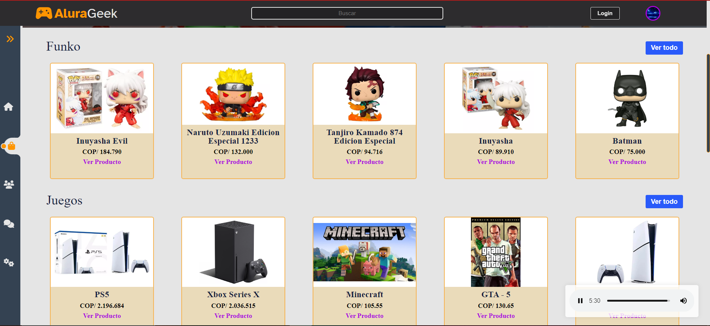

# Challenge AluraGeek - Desafío [AluraGeek] 🚀💻

¡Bienvenido al Challenge AluraGeek!

Este README es una guía para el reto que he completado como parte del Challenge AluraGeek. El reto se enfocó en [breve descripción del reto o proyecto].

## Descripción del Reto 🌟

El reto consistió en desarrollar [descripción detallada del reto o proyecto, incluyendo tecnologías utilizadas, objetivos y alcance].

## Objetivos 🎯

Los objetivos principales de este reto fueron:

- Demostrar habilidades en [menciona las habilidades que aplicaste, como frontend, backend, bases de datos, etc.].
- Crear una solución funcional y eficiente para [desafío específico].
- Aprender y aplicar conceptos clave de [menciona las tecnologías o frameworks utilizados].

## Tecnologías Utilizadas 💡

- [Lista de tecnologías, frameworks o herramientas utilizadas]

## Instrucciones de Uso 📝

1. **Clonar este repositorio:**

   ```bash
   git clone https://github.com/tu-usuario/nombre-del-repo.git
   ```

2. **Instalar las dependencias:**

   ```bash
   cd nombre-del-repo
   npm install
   ```

3. **Ejecutar la aplicación:**

   ```bash
   npm start
   ```

## Capturas de Pantalla 🖼️




## Recursos Adicionales 📚

- [Enlaces a recursos adicionales, como documentación o tutoriales utilizados]

## Contacto 📧

Si tienes alguna pregunta o comentario sobre este proyecto, no dudes en contactarme:

- Email: [gabrielcabralesperez@gmail.com](mailto:gabrielcabralesperez@gmail.com) 📩

¡Gracias por revisar mi proyecto del Challenge AluraGeek! Espero que disfrutes explorando esta implementación. 😊🚀
